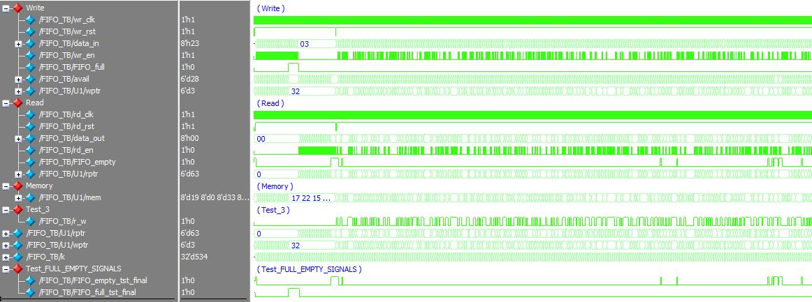
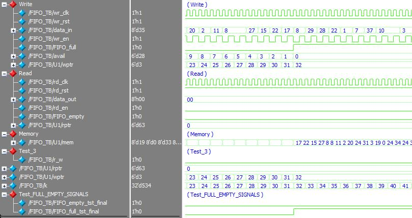
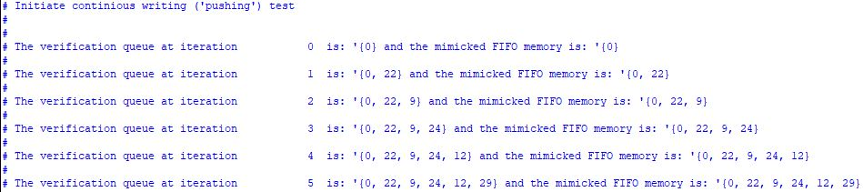
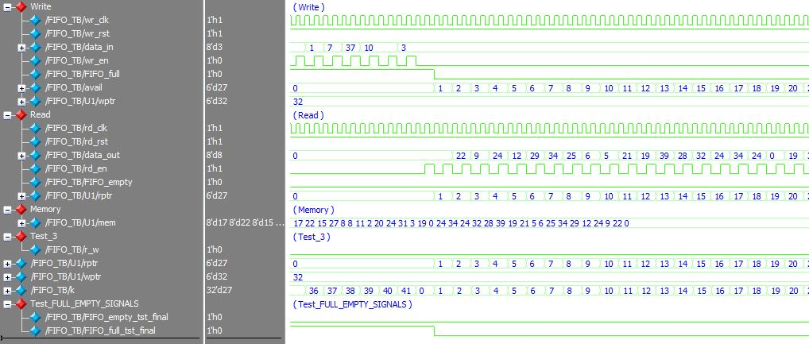
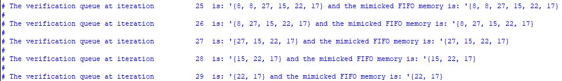
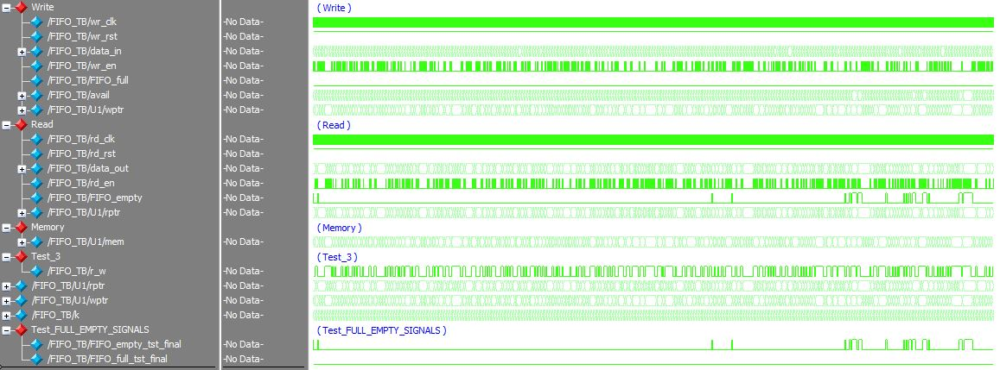
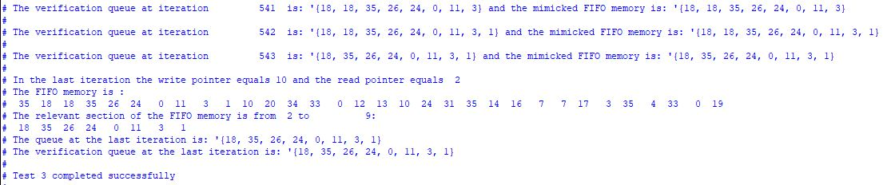

# Synchronous/Asynchronous FIFO Memory

> SystemVerilog Synchronous/Asynchronous FIFO Memory and testbench  

Implementention in SystemVerilog of __synchronous and asynchronous FIFO memory__.  

## Get Started

The source files  are located at the repository root:

- [FIFO_TB](./FIFO_TB.sv)
- [FIFO](./FIFO.sv)

Choosing between Synchronous or Asynchronous implementation is carried out by modifying the 'TYPE' parameter in the module instantiation:
- Synchronous: TYPE=0
- Asynchronous: TYPE=1

To simulate the synchronous/asynchronous simply change the 'TYPE' parameter in the [FIFO_TB](./FIFO_TB.sv) file.
## Testbench

The testbench comprises three tests for a 32 8-bit word FIFO memory: continious writing (left), continious reading (middle) random read/write operation (right):

**Synchronous FIFO memory TB:**
	 

1.	Continious writing of random data to the FIFO memory

	**Continious writing operation (waveform):**
		 

As can be seen, the FIFO_full signal rises to logic high when 32 consecutive write operations are executed and the memory is full. 
Please note that the 'FIFO_full_tst_final' mimicks the 'FIFO_full' signal.

	**Continious writing operation (terminal view):**
		  
	
As can be seen in the terminal view of the first iterations, the mimicked FIFO memory matches the actual FIFO memory ('verification queue')	

2.	Continious reading operation from the FIFO memory  
	
	**Continious reading operation (waveform):**
		 

As can be seen, the read values ('data_out') matches the written values of the previous test.

	**Continious writing operation (terminal):**
		  

Here, a section of the terminal output is shown to illustrate the actual values stored in the mimiced and the actual FIFO_memory
	
3.	Random read/write operation 

In the third test, a read/write command is randomly applied (the distribuition can be modified from the TB).

	**Random read/write operation with equal probabiities (waveform):**
		 
		
	As can be seem, the FIFO_empty condition is reached - this is since the FIFO is empty upon test initiation.
	
	**Random read/write operation with equal probabiities (terminal):**
		 

	As can be seen, a 'write' operation is carried in iteration 542 and a 'read' iteration is carried in the following iteration.
	The comparison between the actual FIFO memory and the mimicked FIFO memory is carried at each iteration.
	
	In the last iteration, the entire FIFO memory is printed alongside its relevant section (between 'read' and 'write' pointers).
	In addition, the final mimicked FIFO memory is printed as well to allow visual comparison.

**Asynchronous FIFO memory TB:**

### Possible Applications

Implementation of the synchronous FIFO memory in a complete UART module can be found in the [following repository](https://github.com/tom-urkin/UART)

## Support

I will be happy to answer any questions.  
Approach me here using GitHub Issues or at tom.urkin@gmail.com