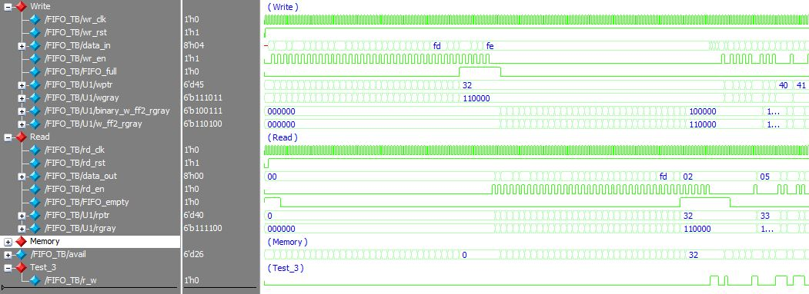
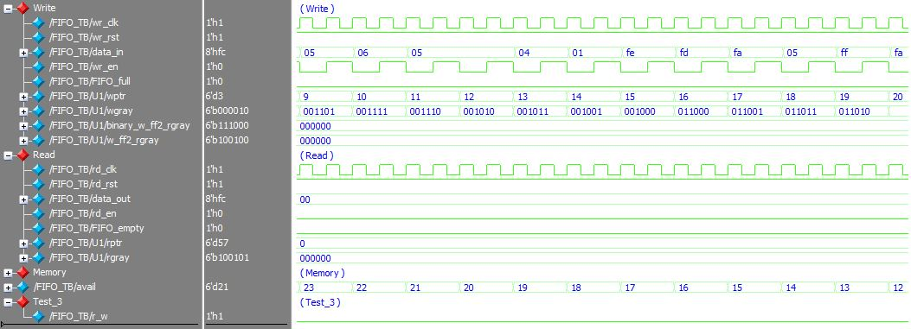
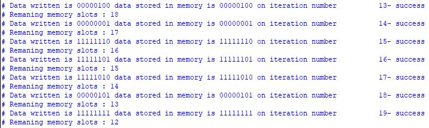
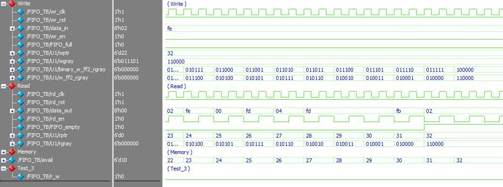
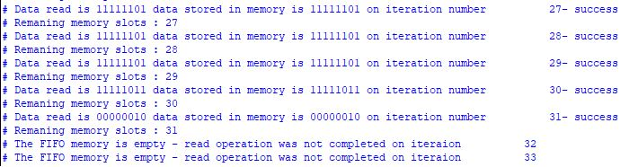
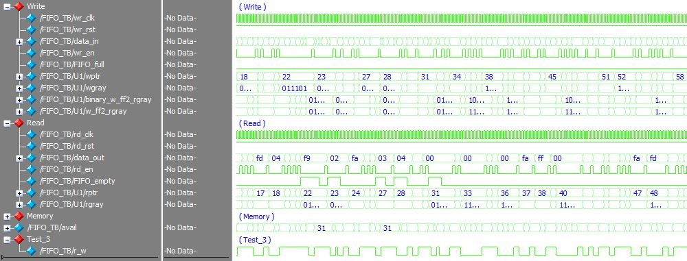

# Synchronous/Asynchronous FIFO Memory

> SystemVerilog Synchronous/Asynchronous FIFO Memory  

Implementention in SystemVerilog of __synchronous and asynchronous FIFO memory__.  

## Get Started

The source files  are located at the repository root:

- [Synchronous_FIFO_TB](./Synchronous_FIFO_TB.sv)
- [Synchronous_FIFO](./Synchronous_FIFO.sv)

Choosing between Synchronous or Asynchronous implementation is carried out by modifying the 'TYPE' parameter in the module instantiation:
- Synchronous: TYPE=0
- Asynchronous: TYPE=1

## Testbench

The testbench comprises three tests for a 32 8-bit word FIFO memory: continious writing (left), continious reading (middle) random read/write operation (right):

**FIFO memory TB:**
	 

1.	Continious writing of random data to the FIFO memory

	**Continious writing operation (waveform):**
		 

	**Continious writing operation (terminal view):**
		  
	
	
2.	Continious reading operation from the FIFO memory  
	
	**Continious reading operation (waveform):**
		 

	**Continious writing operation (terminal):**
		  
	
3.	Random read/write operation 

	**Random read/write operation (waveform):**
		 

### Possible Applications

Implementation of the synchronous FIFO memory in a complete UART module can be found in the [following repository](https://github.com/tom-urkin/UART)

## Support

I will be happy to answer any questions.  
Approach me here using GitHub Issues or at tom.urkin@gmail.com